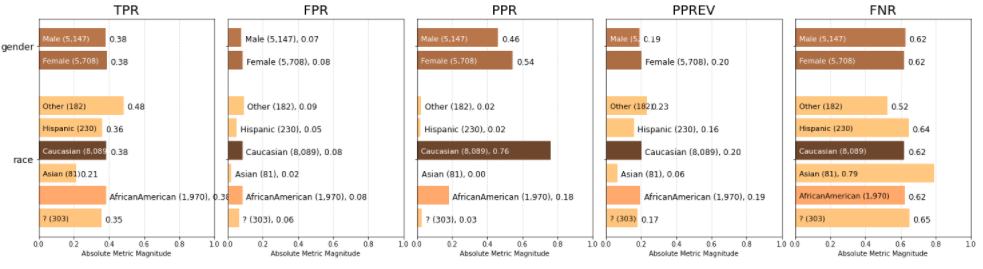

# Analyzing Electronic Health Records with TensorFlow Probability

  
  Demographic bias plots using <a href="https://github.com/dssg/aequitas">Project Aequitas</a> toolkit on probabilistic TensorFlow model.

**Summary**

Apply machine learning to predict hospital stay duration given patient EHR data. Full project details, including description of bias plots above, are located in ***EHR_Analysis.ipynb***.

Project completed as part of Udacity AI for Healthcare course (2020).
